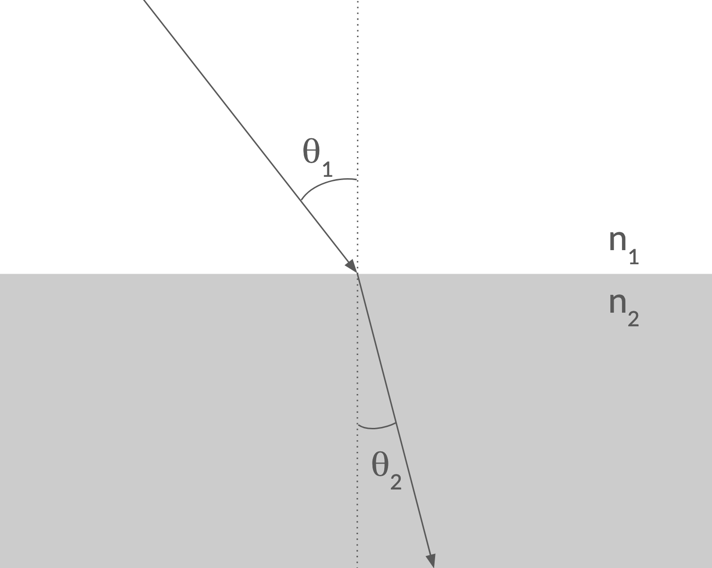



For light passing from one medium to another, the following is true:

$$n_1 \sin(\theta_1) = n_2 \sin(\theta_2)$$

Where:
- \\(n_1\\) is the refractive index of the first medium
- \\(n_2\\) is the refractive index of the second medium
- \\(\theta_1\\) is the angle of incidence, and
- \\(\theta_2\\) is the angle of refraction.

Notice that the angles are taken with respect to the normal to the surface of the media.

## Sources
- [Wikipedia](https://en.wikipedia.org/wiki/Snell%27s_law)
